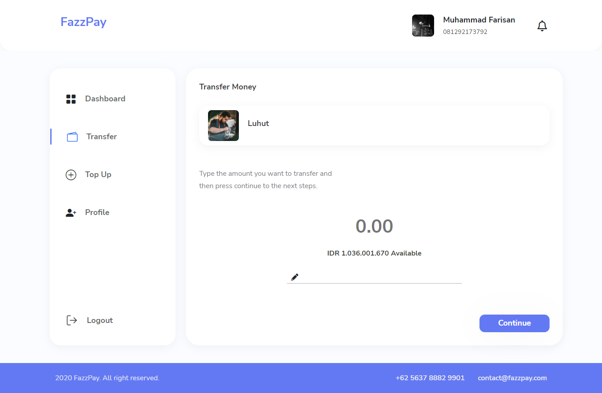
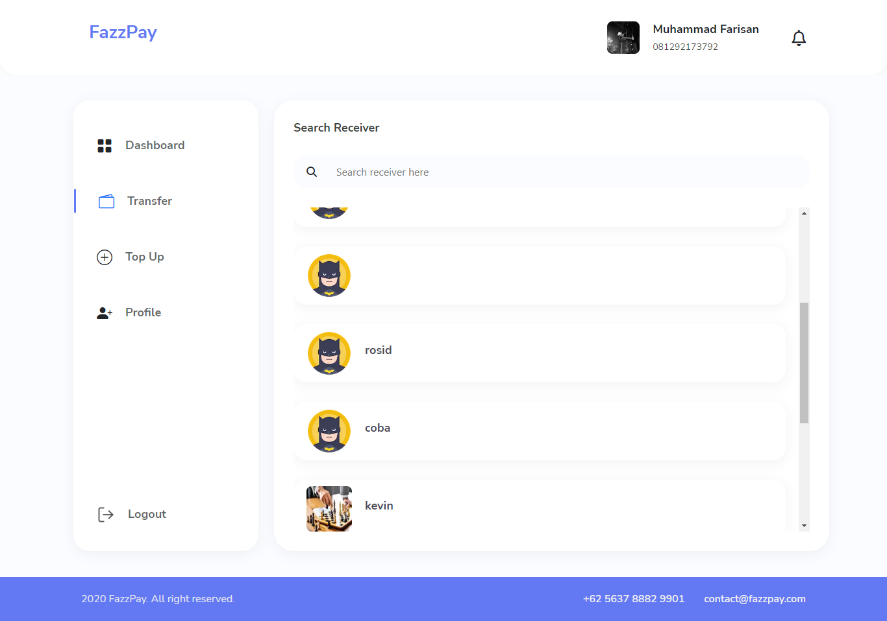

<h1 align="center"><u>Fazzpay 💳</u></h1>
<p align="left">
<h2>Built with</h2>
</p>

[](https://skillicons.dev)

<br>

## Table of Contents

- [Introduction](#introduction)
- [Features](#features)
- [Requirements](#requirements)
- [How to Run App](#how-to-run-the-application)
- [Usage](#Development)
- [Screenshots](#screenshots)
- [Related Project](#related-project)

## Introduction

<h3>Fazzpay</h3>
<p>Fazzpay adalah dompet digital yang memiliki beberapa kegunaan, termasuk untuk online transaksi. Fazzpay juga bisa digunakan untuk menyimpan uang lalu mentransfernya ke rekening.</p>

## Features

- Login
- Register
- Forgot Password
- Edit profile
- Dashboard
- Topup
- Transfer
- Transfer History

## Requirements

[](https://skillicons.dev)

## How to Run the Application

### 1. Clone this repository

Clone this repository by run the following code:

```
git clone https://github.com/farisan/E-wallet-Fazzpay.git
```

### 2. Install dependency packages

Install dependency packages by run the following code inside project folder:

```
npm install
```

### 3. Configure .env file

Configure .env file by create file named .env inside project folder and add this line to the file:

```
NEXT_BACKEND_URL = "https://fazzpay-rose.vercel.app"
CLOUDINARY_LINK = "https://res.cloudinary.com/dd1uwz8eu/image/upload/v1666604839/Fazzpay/example_qx2pf0.png"
CLOUD = "https://res.cloudinary.com/dd1uwz8eu/image/upload/v1666604839/"
```

### 4. Run projects

Run this projects by run the following code:

```
npm run start
```

It runs the app in the development mode.\
Open [http://localhost:3000](http://localhost:3000) to view it in your browser.

The page will reload when you make changes.\
You may also see any lint errors in the console.

## Deployment

Website : [Click Here](https://ewallet-fazzpay.vercel.app/)

## Screenshots App

<table border="2">
    <div align="center">
        
        
        
        
        
    </div>
</table>

## Related Project

- Tickitz (NextJs) [`here`](https://lepisa-fe.vercel.app/)
- Backend FazzPay [`here`](https://documenter.getpostman.com/view/23706970/2s8ZDR8RFJ)

<p align="center"><sub><b>&copy;2022❤️Fazzpay☕</b></sub></p>
